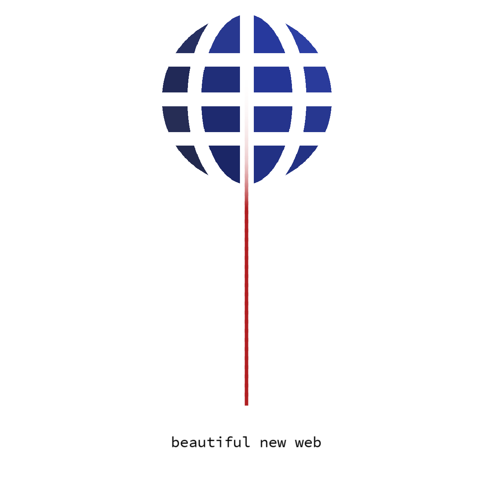

<p align="center"></p>
<p align="center">
  <a href="https://github.com/standard/standard">
    
  </a>
</p>
<p align="center">
  <a href="https://nodei.co/npm/srpc-framework.png?downloads=true&downloadRank=true&stars=true">
    
  </a>
</p>

## Usage
```js
const { createSrpcServer } = require('srpc-framework/src/createSrpcServer')

const functions = { add: ({ a, b }) => a + b }

const port = 8080
const onStartText = `Server successfully launched on port ${port}`
createSrpcServer({ functions, port, onStartText })
```

## Motivation
Web framework that will let you write the code as you envision it. Won't limit you. Won't stand in your way.

Without a need to adjust your though process to it. Without a room for REST. Simplified to it's bare bones.

Ready to acknowledge and embrace today's action-based web apps.

Seamless client->server integration.
